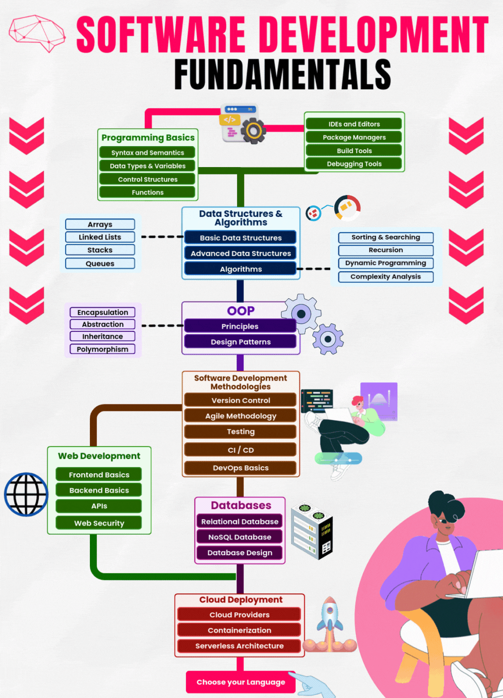
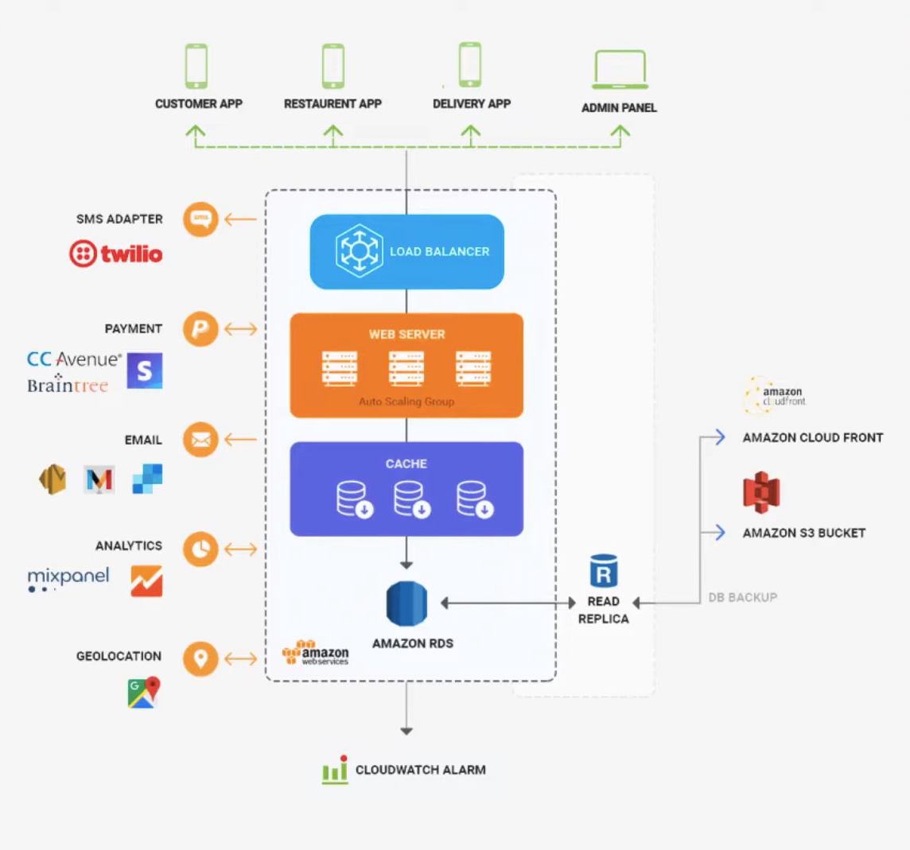

# Etomart
E-Store Platform - Grocery delivery WebApp

# Project Goal:
The primary goal of Etomart is to develop a sustainable food and grocery delivery platform that meets the needs of the Namibian market. This involves conducting a feasibility study to ensure that the platform is viable and capable of addressing local market demands. The study covers various aspects, including market analysis, technological requirements, and potential challenges.

# Feasibility Study Focus:
Market Analysis: Understanding the target market, customer needs, and competition.
Technological Requirements: Assessing the technical aspects required to build and maintain the platform, such as server infrastructure, database management, and user interface design.

# Challenges and Solutions: 
Identifying potential challenges in the Namibian context, such as logistics, internet connectivity, and payment systems, and proposing solutions to address these challenges.
By focusing on these areas, Etomart aims to provide a reliable and user-friendly platform that enhances the accessibility of groceries and essential products for Namibian customers, contributing to the overall goal of sustainability in the market.

# Architecture:
Front-End: React - Back-End/Web Server: Node.js (JavaScript/TypeScript) - Database: Firebase (NoSQL) (Firestore or Realtime Database)  Components  - Client-Side Framework: React - Styling: Tailwind CSS

# Getting Started with Create React App

This project was Strarted with [Create React App](https://github.com/facebook/create-react-app).
**Create a New React App:**

- Open your terminal or command prompt.
- Navigate to the directory where you want to create your app.

Run to **Install project dependencies**

```jsx
npm install
```

Run

```jsx
npm install react-scripts --save
```

Update Node.js and npm

```jsx
npm install -g npm
```

- Run the following command to update Nodejs to a set version! (Optional)

```jsx
npm install -g npm@10.4.0 
```
## Available Scripts

In the project directory, you can run:

### `npm start`

Runs the app in the development mode.\
Open [http://localhost:3000](http://localhost:3000) to view it in your browser.

The page will reload when you make changes.\
You may also see any lint errors in the console.

### `npm test`

Launches the test runner in the interactive watch mode.\
See the section about [running tests](https://facebook.github.io/create-react-app/docs/running-tests) for more information.

### `npx eslint --cache --debug --fix`
## `or`
### `npx eslint src --cache --fix`
## `or`
### `npx eslint src --cache --debug --fix`

npx: This command is used to execute ESLint without having it installed globally. It will download and execute the latest version of ESLint from the npm registry.
eslint: This is the command to run the ESLint linter.
src: This specifies the directory to be linted.
--cache: This flag tells ESLint to cache the linting results, which can improve performance for subsequent runs.
--debug: This flag enables debug mode, which provides more detailed output about the linting process.
--fix: This flag tells ESLint to automatically fix any linting errors it encounters.

### `npm run lint`
npm run lint to check your code
### `npm run lint:fix`
npm run lint:fix to check and automatically fix issues where possible
### `npm run lint:debug`
npm run lint:debug to run the linter with debug output for troubleshooting

These run the scripts we defined in your package.json, which are for example:
"lint:debug": "eslint \"src/**/*.{js,jsx,ts,tsx}\" --debug --fix --cache"
Running npm run lint:debug is generally safe and shouldn't break your code implementation. Here's what it will do:

Analyze your code: It will check all JavaScript and TypeScript files in your src directory against the ESLint rules we've configured.
Report issues: It will output any linting errors or warnings it finds. This includes things like unused variables, improper syntax, or violations of the rules we've set up (like Tailwind CSS class ordering).
Attempt to fix issues: The --fix flag in the script means it will try to automatically correct issues that have safe, predetermined fixes. This includes things like:

Formatting issues (indentation, whitespace)
Simple syntax errors
Reordering of Tailwind CSS classes


Provide debug output: The --debug flag will give you detailed information about what ESLint is doing, which can be helpful for troubleshooting.
Use caching: The --cache flag means it will cache results to speed up future linting runs.

Important points:

Code functionality: ESLint doesn't change the logic or functionality of your code. It focuses on style, potential errors, and best practices.
Safe fixes: The automatic fixes applied are designed to be safe and not change the behavior of your code.
No commits: This command doesn't commit any changes. You'll have the opportunity to review any modifications before committing them.
Tailwind classes: It may reorder your Tailwind CSS classes, but this shouldn't affect their functionality.

However, there are a few things to be aware of:

Large number of changes: If this is the first time you're running ESLint on your project, you might see a large number of suggested changes. Don't be alarmed; this is normal.
Review changes: Always review the changes ESLint makes, especially if you're running it for the first time on a large codebase.
Custom code: If you have very custom or complex code, there's a small chance that some automatic fixes might not be appropriate for your specific use case.
Performance: The debug output can be verbose. If your project is very large, the command might take some time to complete.

In summary, npm run lint:debug is a safe command to run. It won't break your code implementation, but it may suggest or make style and best practice changes. Always review the output and any changes made to ensure they align with your project's needs. If you're unsure about any changes, you can always run without the --fix flag first to see what would be changed without actually making the changes.

### `npm run lint:fix`

To address these issues, you can:

Run the linter with the --fix option to automatically fix some issues:
npm run lint:fix

Manually update Tailwind CSS class names as suggested in the warnings.
Review and update React Hook dependencies.
Address accessibility issues, particularly the invalid href in UserProfileIcon.js.
Resolve conflicting Tailwind classes.
Consider updating your Tailwind configuration to include custom class names that are frequently used in your project.
For warnings about custom class names that you intentionally use, you might want to add them to the tailwindcss.whitelist in your ESLint configuration.

### `npm run build`

Builds the app for production to the `build` folder.\
It correctly bundles React in production mode and optimizes the build for the best performance.

The build is minified and the filenames include the hashes.\
Your app is ready to be deployed!

See the section about [deployment](https://facebook.github.io/create-react-app/docs/deployment) for more information.

### `npm run eject`

**Note: this is a one-way operation. Once you `eject`, you can't go back!**

If you aren't satisfied with the build tool and configuration choices, you can `eject` at any time. This command will remove the single build dependency from your project.

Instead, it will copy all the configuration files and the transitive dependencies (webpack, Babel, ESLint, etc) right into your project so you have full control over them. All of the commands except `eject` will still work, but they will point to the copied scripts so you can tweak them. At this point you're on your own.

You don't have to ever use `eject`. The curated feature set is suitable for small and middle deployments, and you shouldn't feel obligated to use this feature. However we understand that this tool wouldn't be useful if you couldn't customize it when you are ready for it.

## Development Pipeline

### 1. Process
Software Development Fundamentals.



### 2. Process
Processes must enable faster feedback cycles and create a culture for learning 

### 3. Architecture
Architecture should be agile for change and resilient to failure

### 4. Technology
Technology is imperative for innovation, increasing productivity and maximizing impact

### 5. Infrastructure
A robust infrastructure is the foundation for innovative platforms.


### 6. System Architecture Diagram/High-Level Architecture Diagram
A High-Level Architecture Diagram



## Periodic Table of DevOps Tools


## Learn More

You can learn more in the [Create React App documentation](https://facebook.github.io/create-react-app/docs/getting-started).

To learn React, check out the [React documentation](https://reactjs.org/).

### Code Splitting

This section has moved here: [https://facebook.github.io/create-react-app/docs/code-splitting](https://facebook.github.io/create-react-app/docs/code-splitting)

### Analyzing the Bundle Size

This section has moved here: [https://facebook.github.io/create-react-app/docs/analyzing-the-bundle-size](https://facebook.github.io/create-react-app/docs/analyzing-the-bundle-size)

### Making a Progressive Web App

This section has moved here: [https://facebook.github.io/create-react-app/docs/making-a-progressive-web-app](https://facebook.github.io/create-react-app/docs/making-a-progressive-web-app)

### Advanced Configuration

This section has moved here: [https://facebook.github.io/create-react-app/docs/advanced-configuration](https://facebook.github.io/create-react-app/docs/advanced-configuration)

### Deployment

This section has moved here: [https://facebook.github.io/create-react-app/docs/deployment](https://facebook.github.io/create-react-app/docs/deployment)

### `npm run build` fails to minify

### This section has moved here: [https://facebook.github.io/create-react-app/docs/troubleshooting#npm-run-build-fails-to-minify](https://facebook.github.io/create-react-app/docs/troubleshooting#npm-run-build-fails-to-minify)

>>>>>>> 80f072c01236aa31541b82aec4db921112cbafa4
